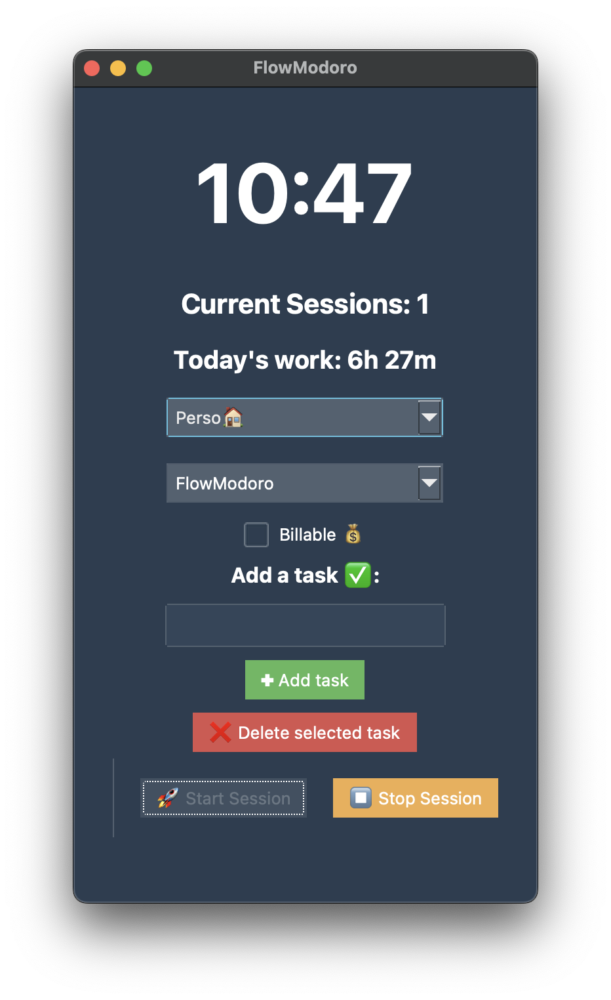

# 🚀 FlowModoro - Gestion optimisée du temps avec méthode Pomodoro améliorée

<!-- Badges -->
<p align="left">
  <a href="https://opensource.org/licenses/MIT"></a>
  
  
  
  
</p>

## Table des Matières

- [🚀 FlowModoro - Gestion optimisée du temps avec méthode Pomodoro améliorée](#-flowmodoro---gestion-optimisée-du-temps-avec-méthode-pomodoro-améliorée)
  - [Table des Matières](#table-des-matières)
  - [🎯 Objectifs de FlowModoro](#-objectifs-de-flowmodoro)
  - [🌟 Fonctionnalités clés](#-fonctionnalités-clés)
    - [⏰ Gestion intelligente des sessions](#-gestion-intelligente-des-sessions)
    - [📂 Gestion des catégories et des tâches](#-gestion-des-catégories-et-des-tâches)
    - [📈 Analyse détaillée de ta productivité](#-analyse-détaillée-de-ta-productivité)
    - [🎨 Interface utilisateur ergonomique](#-interface-utilisateur-ergonomique)
  - [📸 Capture d'Écran](#-capture-décran)
  - [🛠️ Installation](#️-installation)
    - [Option 1 : Installation classique (environnement Python)](#option-1--installation-classique-environnement-python)
    - [Option 2 : Utilisation avec Docker](#option-2--utilisation-avec-docker)
  - [📝 Utilisation](#-utilisation)
  - [⚙️ Configuration](#️-configuration)
  - [📝 Licence](#-licence)

## 🎯 Objectifs de FlowModoro

- Maximiser ta productivité avec des sessions de travail structurées.
- Faciliter le suivi du temps passé par tâches et catégories.
- Améliorer l’équilibre travail-pause pour rester concentré.
- Rendre agréable et ludique la gestion quotidienne du temps.

## 🌟 Fonctionnalités clés

### ⏰ Gestion intelligente des sessions
- Sessions de travail automatisées : Timer intégré, démarrage/arrêt clair.
- Calcul automatique des pauses : Pause dynamique basée sur la durée du travail (pause = travail/5).
- Notifications sonores et Push (via Pushover) : Rappels doux mais efficaces à la fin des sessions.

### 📂 Gestion des catégories et des tâches
- Catégories personnalisées avec icônes pour une meilleure visualisation :
  - Formation 📚
  - Pro 💼
  - Perso 🏠
- Gestion intuitive des tâches :
  - Ajout rapide avec option « Billable 💰 ».
  - Suppression facile des tâches.

### 📈 Analyse détaillée de ta productivité
- Historique quotidien et hebdomadaire clair.
- Analyse détaillée du temps passé par tâche et catégorie.
- Export facile au format CSV pour un suivi précis et réutilisable.
- Graphiques interactifs pour visualiser ton activité efficacement.

### 🎨 Interface utilisateur ergonomique
- Interface moderne utilisant ttkbootstrap avec thèmes personnalisables :
  - Superhero, Darkly, Flatly, Minty, Cyborg, Journal, Solar.
- Intégration d’emojis et d’icônes pour une expérience visuelle ludique et agréable.

## 📸 Capture d'Écran



*Capture d'écran de l'interface principale de FlowModoro.*

## 🛠️ Installation

### Option 1 : Installation classique (environnement Python)

1. Clone le dépôt :
```bash
git clone https://github.com/arnaudstdr/flowmodoro.git
cd flowmodoro
```

2. Installe les dépendances :
```bash
pip install -r requirements.txt
```

3. Configure tes clés API (pour Pushover) dans un fichier `.env` :
```env
PUSHOVER_USER_KEY=your_user_key
PUSHOVER_API_TOKEN=your_api_token
```

4. Lance l'application :
```bash
python main.py
```

---

### Option 2 : Utilisation avec Docker

1. Clone le dépôt :
```bash
git clone https://github.com/arnaudstdr/flowmodoro.git
cd flowmodoro
```

2. Construis l'image Docker :
```bash
docker build -t flowmodoro .
```

3. Lance l'application dans un conteneur :
```bash
docker run --rm -it \
  -e PUSHOVER_USER_KEY=your_user_key \
  -e PUSHOVER_API_TOKEN=your_api_token \
  flowmodoro
```

> Remplace `your_user_key` et `your_api_token` par tes propres clés Pushover.

---

## 📝 Utilisation
1. **Démarrer une session** : Clique sur le bouton "Start" pour commencer une session de travail.
2. **Ajouter une tâche** : Utilise le menu déroulant pour sélectionner ou ajouter une nouvelle tâche.
3. **Configurer les paramètres** : Accède aux paramètres via le menu "Settings" pour ajuster les notifications, le son, et le thème.

## ⚙️ Configuration
Tu peux ajuster les paramètres suivants dans la fenêtre dédiée accessible depuis le menu “Settings” :
- Activation/Désactivation du son 🎶
- Activation/Désactivation des notifications Push 📲
- Choix du thème 🎨
- Activation du rappel automatique en cas d’inactivité ⏳

## 📝 Licence
Ce projet est distribué sous licence MIT. Voir LICENSE pour plus d’informations.


**Bonne productivité avec FlowModoro !** 🚀